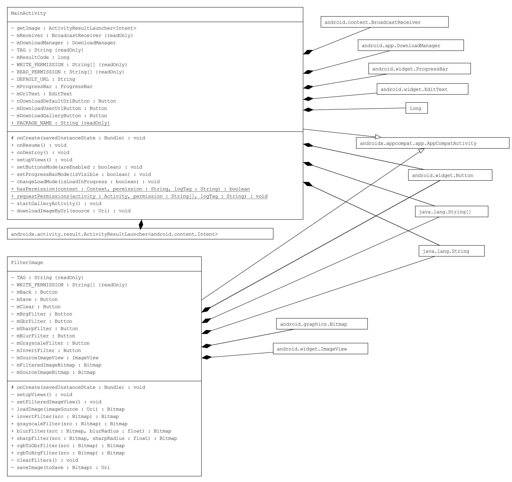

# Image filtering
This application is written for the Coursera Capstone MOOC for "Android App Development" Specialization.

## Purpose of app
Apply filters to chosen image and save filtered image to device.

## Key features
- User can choose image to filter in three ways:
	- Select image from device's storage;
	- Download image from Internet by specifying its URL;
	- Download image from Internet by choosing default URL.
- User can apply any amount of filters to image. Available filters are:
	- Color inversion;
	- Convert to grayscale;
	- Gaussian blur;
	- Sharpening;
	- GBR (Switch colors in such way: Red to Green, Green to Blue, Blue to Red);
	- BRG (Switch colors in such way: Red to Blue, Green to Red, Blue to Green).
- User can clear all filters from image to reapply filters in other way.
- User can save filtered image to local storage.

## Fundamental Android components used in this app
- **Activities** to:
	- Choose image load method;
	- Choose image from gallery;
	- Apply filters to image;
- **DownloadManager Service** to download image from URL;
- **BroadcastReceiver** to process finished download;
- **ContentProvider** to load and save images in local storage.

## Interaction with remote web service
In case user chooses to download image from default URL, the image will be downloaded from *http://picsum.photos/500*
This URL generates random JPEG image sized 500x500 pixels.

## Main components
